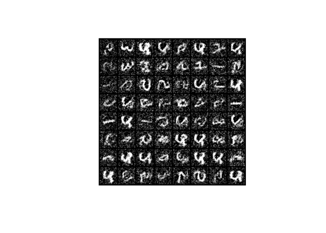

<!-- README.md is generated from README.Rmd. Please edit that file -->

# JEM

<!-- badges: start -->

<!-- badges: end -->

An R implementation of [‘Your Classifier is Secretly an Energy Based
Model and You Should Treat it Like
One’](https://arxiv.org/abs/1912.03263). Code heavily inspired by
<https://github.com/tohmae/pytorch-jem> and
<https://github.com/wgrathwohl/JEM>.

## Installation

JEM is not on CRAN and can be installed with:

``` r
remotes::install_github("dfalbel/JEM")
```

## Experiment

We are going to use the following configuration:

    default:
      dataset: "mnist"
      model: "mlp"
      n_epochs: 5
      lr: 0.001
      rho: 0.05
      eta: 20
      sigma: 0.01
      alpha: 1
      buffer_size: 10000
      device: "cuda"
      batch_size: 100

``` r
experiment <- JEM::run_experiment()
#> 
#> ── Experiment config ──────────────────────────────────────────────────────────────────────────────────────────────────────
#> → dataset : mnist
#> → model : mlp
#> → n_epochs : 5
#> → lr : 0.001
#> → rho : 0.05
#> → eta : 20
#> → sigma : 0.01
#> → alpha : 1
#> → buffer_size : 10000
#> → device : cuda
#> → batch_size : 100
#> ───────────────────────────────────────────────────────────────────────────────────────────────────────────────────────────
#> [Epoch 1] Train{Loss: 0.741618} Valid{Loss: 0.202188, Acc: 0.950000}
#> [Epoch 2] Train{Loss: 0.190536} Valid{Loss: 0.119359, Acc: 0.969700}
#> [Epoch 3] Train{Loss: 0.191412} Valid{Loss: 0.093935, Acc: 0.974000}
#> [Epoch 4] Train{Loss: 0.168684} Valid{Loss: 0.088714, Acc: 0.973200}
#> [Epoch 5] Train{Loss: 0.151446} Valid{Loss: 0.072674, Acc: 0.978200}
```

After the model is run, you can generate samples from p(x) with:

``` r
samples <- JEM::generate_samples(experiment, 64, eta = 200)
JEM::plot_samples(samples)
```


