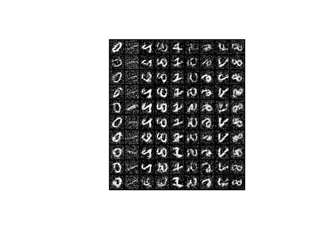

<!-- README.md is generated from README.Rmd. Please edit that file -->

# JEM

<!-- badges: start -->

<!-- badges: end -->

An R implementation of [‘Your Classifier is Secretly an Energy Based
Model and You Should Treat it Like
One’](https://arxiv.org/abs/1912.03263). Code heavily inspired by
<https://github.com/tohmae/pytorch-jem> and
<https://github.com/wgrathwohl/JEM>.

## Installation

JEM is not on CRAN and can be installed with:

``` r
remotes::install_github("dfalbel/JEM")
```

## Experiment

You can run an experiment with the `run_experiment` function. The
configuration is found by default in the `config.yaml` file in the root
directory.

``` r
experiment <- JEM::run_experiment()
#> 
#> ── Experiment config ────────────────────────────────────────────────────────────────────────────────────────────────
#> → dataset : mnist
#> → model : mlp
#> → n_epochs : 5
#> → lr : 0.001
#> → rho : 0.05
#> → eta : 20
#> → sigma : 0.01
#> → alpha : 1
#> → buffer_size : 10000
#> → device : cuda
#> → batch_size : 100
#> → conditional : TRUE
#> ─────────────────────────────────────────────────────────────────────────────────────────────────────────────────────
#> [Epoch 1] Train{Loss: 0.856000} Valid{Loss: 0.258047, Acc: 0.926600}
#> [Epoch 2] Train{Loss: 0.131079} Valid{Loss: 0.147414, Acc: 0.960800}
#> [Epoch 3] Train{Loss: 0.178203} Valid{Loss: 0.126619, Acc: 0.964900}
#> [Epoch 4] Train{Loss: 0.160592} Valid{Loss: 0.124880, Acc: 0.961600}
#> [Epoch 5] Train{Loss: 0.138205} Valid{Loss: 0.093921, Acc: 0.971300}
```

After the model is run, you can generate samples from \(p(x|y)\) with:

``` r
samples <- JEM::generate_samples(
  experiment, 
  rep(1:9, each = 10), 
  eta = 200
)
JEM::plot_samples(samples, nrow = 10)
```


